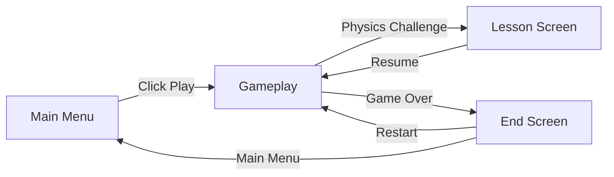
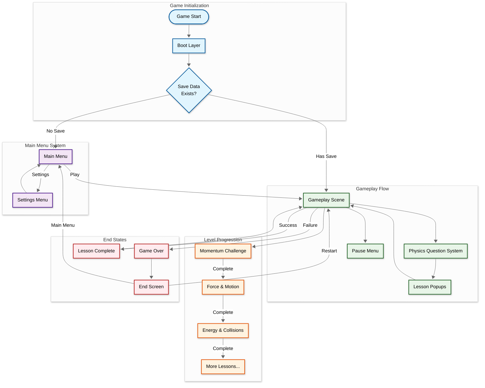
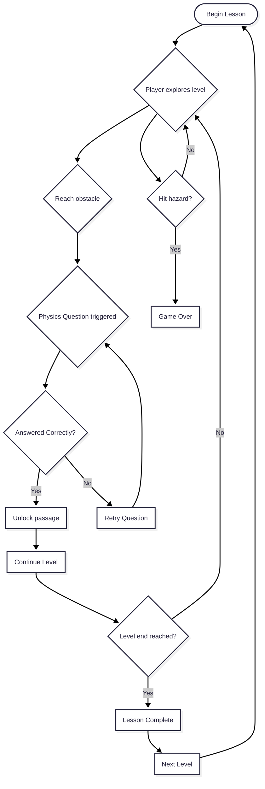
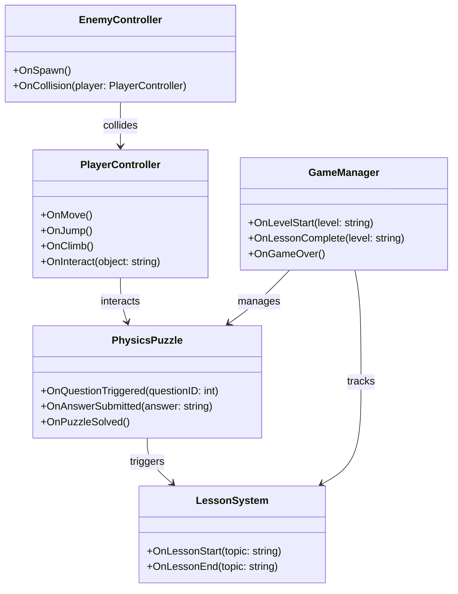

# Physics Learner

<table>
  <tr>
    <td align="left" width="50%">
      
    </td>
    <td align="right" width="50%">
      
    </td>
  </tr>
</table>

---

## Scene Flow 

---

## Layer / Module Design 

---

## Modules and Features

| 📂 Name | 🎬 Scene | 📋 Responsibility |
|---------|----------|-------------------|
| **MainMenu** | **Main Menu** | - Show menu UI - Start new game or load save - Exit game |
| **Settings** | **Main Menu** **Gameplay** | - Adjust audio, difficulty, and accessibility options |
| **GameManager** | **Gameplay** | - Handle progression between lessons - Track score & learning milestones |
| **PlayerController** | **Gameplay** | - Control robot movement and jumps - Interact with physics-based objects - Apply learned mechanics |
| **PhysicsPuzzle** | **Gameplay** | - Spawn questions integrated into environment - Pause gameplay until solved - Unlock gates or items on success |
| **LessonSystem** | **Gameplay** | - Provide short explanations of physics concepts - Display diagrams or hints |
| **EnemyController** | **Gameplay** | - Spawn moving obstacles - React to player physics (momentum, collisions) |
| **Ladder/PlatformSystem** | **Gameplay** | - Enable climbing, ladders, moving platforms - Teach applied forces |
| **HealthSystem** | **Gameplay** | - Manage player life - Reset on hazard collision |
| **GameOver** | **Gameplay** | - Display failure screen - Allow retry or exit |

---

## Game Flow Chart

---

## Event Signal Diagram

---

## Developer & Contributions

- Adiguna S Ligawan (Game Developer & Designer)  
   

---

## About

**Physics Platformer** combines fun platforming action with interactive physics education. As players guide a friendly robot through bright pixel-art levels, they encounter obstacles that can only be solved by answering real-world physics questions. Each challenge integrates lessons about momentum, force, and motion directly into gameplay.

---

## Key Features

**Physics-Based Gameplay**: Movement and challenges directly reflect physics principles like momentum, gravity, and force.  

**Interactive Lessons**: Embedded lessons appear at obstacles, reinforcing learning through action.  

**Robot Character**: A friendly companion makes the game accessible to all ages.  

**Progressive Difficulty**: Lessons scale with deeper levels, teaching increasingly complex concepts.  

**Pixel Art Style**: Bright visuals ensure a fun and engaging learning experience.  

---

## Play The Game

<a href="#">Play Now</a>  
 

⚠️ COMPATIBILITY WARNING
Please be advised that this game was developed using Godot Engine version 4.0, which is may be considered a legacy version.
